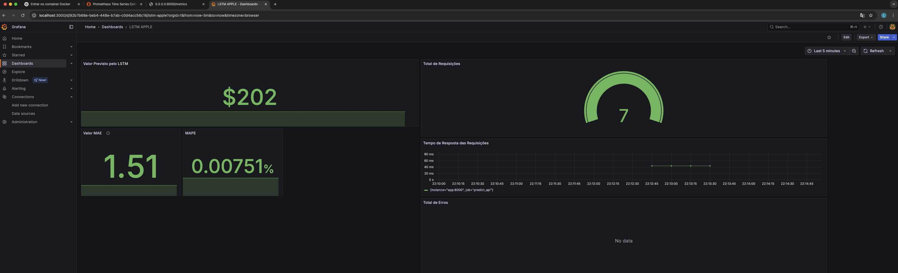

# 📌 Objetivo

Prever o valor de fechamento das ações de uma empresa (Apple Inc.) utilizando um modelo de deep learning baseado em LSTM. O projeto abrange:

* Coleta e armazenamento de dados históricos
* Tratamento e preprocessamento dos dados
* Treinamento e validação do modelo com otimização via Optuna
* Versionamento com MLflow
* Deploy de uma API em produção (FastAPI)
* Monitoramento e observabilidade com Prometheus e Grafana

---

# ⚙️ O Projeto

## 🧠 Tecnologias Utilizadas

* **Python 3.10**
* **PyTorch** – modelo LSTM para séries temporais
* **Optuna** – busca de hiperparâmetros eficientes
* **MLflow** – versionamento e registro de modelos
* **FastAPI** – API REST para predição em tempo real
* **PostgreSQL** – armazenamento dos dados históricos e preditos
* **SQLAlchemy** – ORM para interação com o banco
* **Prometheus** – coleta de métricas
* **Grafana** – visualização das métricas
* **Docker & Docker Compose** – orquestração dos containers

## 📦 Containers

* **`python_app`**: aplicação principal com:

  * Ingestão de dados via `yfinance`
  * Treinamento do modelo com Optuna
  * Versionamento com MLflow
  * API REST com rota `/predict`

* **`monitoring_app`**: aplicação Python que extrai métricas do banco e expõe para Prometheus via `/metrics`

* **`prometheus`**: coleta e armazena métricas expostas pela API

* **`grafana`**: visualiza as métricas de desempenho e operação do modelo

## 📋 Esquema da Tabela PostgreSQL `apple_stonks`

```sql
CREATE TABLE apple_stonks (
  id SERIAL PRIMARY KEY,
  date DATE UNIQUE NOT NULL,
  valor FLOAT NOT NULL DEFAULT 0,
  valor_previsto FLOAT,
  modelo_version TEXT,
  is_predict BOOLEAN DEFAULT FALSE
);
```

---

# 📈 Observabilidade

Métricas coletadas e exibidas no dashboard do Grafana:

* `MAE` (Mean Absolute Error)
* `MAPE` (Mean Absolute Percentage Error)
* Valor previsto pelo modelo (predição do dia)
* Tempo de resposta da API `/predict`
* Quantidade total de requisições
* Total de exceções na predição



---

# 🚀 Execução via Docker Compose

```bash
git clone https://github.com/seu-usuario/nome-do-repo.git
cd nome-do-repo
docker-compose up --build
```

Serviços expostos:

* API: [http://localhost:8000/predict](http://localhost:8000/predict)
* Prometheus: [http://localhost:9090](http://localhost:9090)
* Grafana: [http://localhost:3000](http://localhost:3000) (login padrão: admin / admin)

---

# 📁 Estrutura do Projeto

```
project-root/
├── app/
│   ├── modules/
│   │   ├── lstm_module.py
│   │   ├── ingestion_module.py
│   │   └── api_module.py
│   └── main.py
├── monitoring/
│   └── metrics.py
├── Dockerfile
├── docker-compose.yml
└── README.md
```

---
